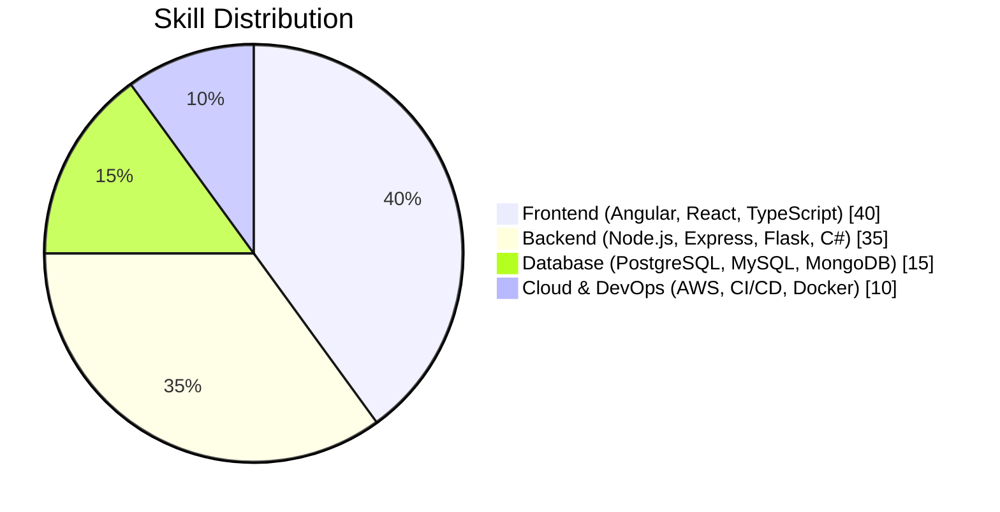

<!-- Banner -->

# Hello, it's Stivan

> I help teams **ship dependable web apps** and **make releases faster** by tightening data models, tuning queries, and automating delivery.  
> Recently: features used by **100+ UK garages**, boosted DB/API performance, and rolled out **CI/CD** for safer deploys.

---

### 📊 Quick impact

- Cut query/load times on high-traffic systems (1M+ rows) by up to **40%**, improving reliability and UX.  
- Built and hardened **REST APIs** (Node/Express), integrated **AWS S3** for uploads, and set up **GitHub Actions** for continuous delivery.  
- Freelance record: **100% on-time, on-budget** delivery across custom apps (booking, e-commerce, quoting, stock mgmt).

---

### 🧰 Main skills

  
  
  
  
  
  
  
  
  
  
  
  
  
  
  
  
  

---

### 🧾 Technical Breakdown

#### 🔹 Full-Stack Focus Chart

---

## 📚 Current Focus

🚗 **Motor Trade Technologies**  
Enhancing the SiteCheck platform — developing **incident tracking**, **risk scoring**, and performance-focused backend improvements.

⚙️ **CI/CD Automation**  
Creating reusable **GitHub Actions** pipelines for faster, safer deployments across environments.

🐘 **PostgreSQL Optimization**  
Tuning queries and refining schema design to handle **scalable, data-heavy** applications with ease.

---

## 🤝 Connect with Me

  
  

---

<!-- Footer --> 
